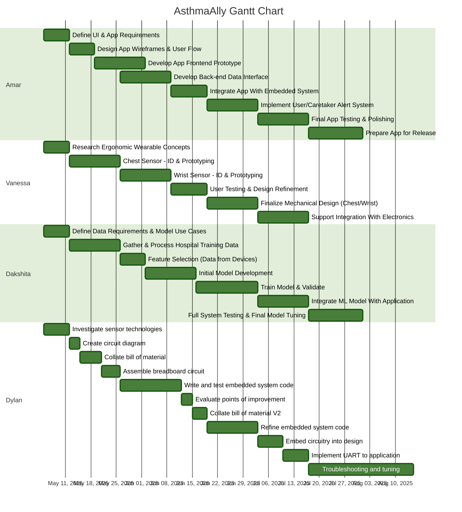

---
tags:
  - y2s3-MnT
status: Ongoing
cssclasses:
  - wide-page
---
# Hello!
Read on to explore the block diagram that maps out our project pathways!
[[AsthmaAlly_block_diagram.excalidraw|excalidraw link]]
## The Block Diagram
![[AsthmaAlly_block_diagram.excalidraw.png]]

## The Gantt Diagram
